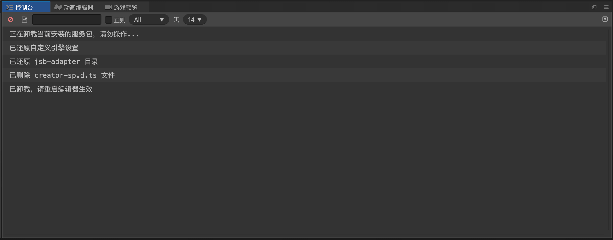

# 卸载指南

服务包不会对项目进行修改，但就像要将引擎降级一样，这种操作还是有风险的，所以我们提供两种卸载方式以供参考：

:::tip 提示

因为原理是一样的，即使是手动安装的服务包，依然可以通过引擎扩展进行卸载，反之亦然。

:::

---
## 使用引擎扩展卸载 

请参考 [手动卸载](#手动卸载) 中提到的 **解除代码依赖与资源依赖**，确保项目不再依赖任何服务包的特性之后再卸载。

在 Cocos Creator 的菜单栏依次点击 **扩展 - 服务包管理 - 卸载服务包** 即可。

之后重启即可生效。

---
## 手动卸载

### 1.代码依赖

如果你的是 TypeScript 项目，则可以先删除 `creator-sp.d.ts` 文件，让 TypeScript 对使用了服务包接口的代码发出报错。

之后我们要确保所有代码都不再依赖服务包的特性。

### 2.资源依赖

服务包提供了一些内置资源，像是多纹理 Effect 着色器资源，你可以通过查找 UUID 引用将对服务包内置资源的引用全部移除。

### 3.恢复自定义引擎与删除扩展

打开 Cocos Creator 菜单的项目 - 项目设置 - 自定义引擎，勾选使用内置引擎。

点击 Cocos Creator 主界面右上角的 **编辑器** 按钮，进入到编辑器的资源目录。

然后使用未修改过的 `jsb-adapter` 替换掉编辑器的 `Resources/builtin/jsb-adapter` 目录，最后将服务包的引擎扩展（比如 `service-pack-support` 目录）删除。
