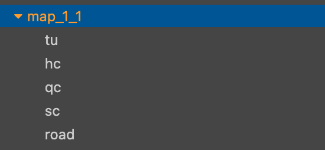
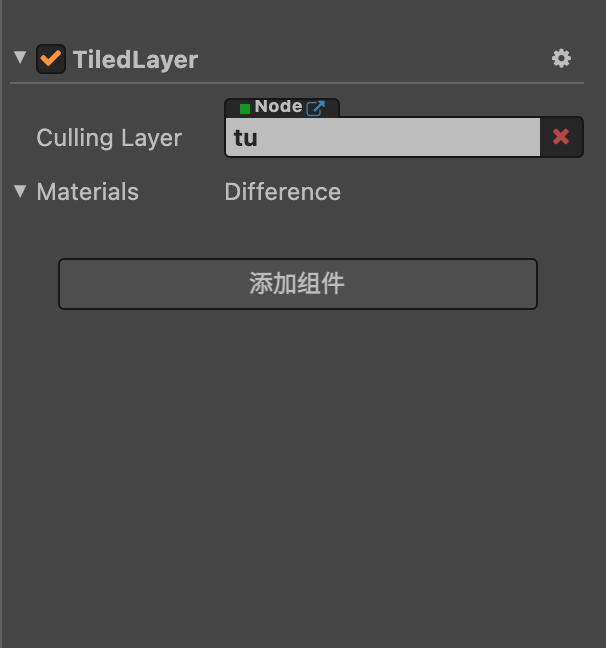

# 复用 Culling 数据

一个 TiledMap 可能会有很多 TiledLayer，如果开启了 Culling，那这些 Layer 都需要单独计算 Culling 数据，增强包新增了在满足一定条件的情况下可以复用 Culling 数据的特性，以减少 CPU 的性能消耗。

## 大致原理

通过为 TiledLayer 指定另一个 TiledLayer，来复用指定的 TiledLayer 的 Culling 数据。

## 前提条件

- 两者的世界矩阵（也是大小、位置、缩放等属性）一致
- 两者所用的 Camera 一致
- 两者的 TiledLayer 类型、属性一致
- 确保被复用的 Layer 会更早进行渲染（否则 Culling 数据同步可能会延迟一帧） 

:::tip 注意

复用可以是不同 TiledMap 的 TiledLayer，但一定要满足上面几个条件，否则 Culling 结果可能不正确。

:::

## 使用方式

假设项目中有 TiledMap 由 5 个 TiledLayer 组合成一张地图。

这种情况如果需要复用 Culling 数据只需要多选后四个节点，然后将第一个节点拖入这四个节点的 `Culling Layer` 属性中即可。

这样就使后四个 Layer 复用第一个 Layer 的 Culling 数据了。
