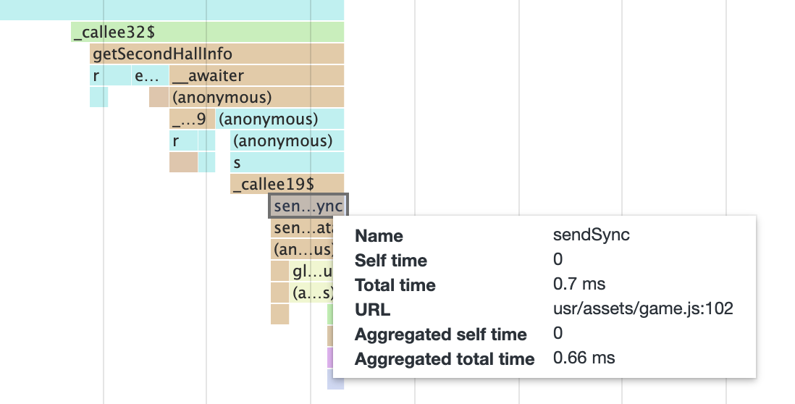

# WebSocket

依次点击编辑器的菜单项 **项目 - 社区版设置**，然后勾选 **多线程驱动 WebSocket**，即可启用这一特性。

启用后，有关于 WebSocket 的操作将会在 Worker 线程中执行，完全释放对主线程的占用。

并且，通过 [自定义多线程扩展](./thread-custom) 你还可以将项目本身的 WebSocket 数据解析操作转移至线程内执行，接下来我们会用一个例子来详细介绍。

下面是在 Android 设备上，在优化前对游戏帧耗时的分析图：


下面是优化后：



可以看到网络请求的耗时从 5.8ms 降低至 0.7ms。

:::caution 注意

需注意，不是任何情况下启用多线程支持都能得到性能提升，因为线程之间有通信成本，如果收发大量数据可能导致卡顿，请实际测试性能是否有提升！

:::

## 自定义数据解析

接下来我们以一个使用 Protobuf + WebSocket 进行网络通信的游戏为例子来介绍如何将所有网络层逻辑都移至线程中执行。

我们首先启用 **多线程驱动 WebSocket**，这时候，项目无需任何改动，WebSocket 实际操作即已在线程中进行。

但是在发送数据到 WebSocket 前；或者从 WebSocket 接收到数据后，都需要首先使用 Protobuf 进行编解码，这部分的逻辑也应该移至线程中进行。

首先创建 **自定义多线程扩展**，然后我们可以新建一个 `ws-parser.js` 脚本文件，先编写下面的代码：

```js
globalThis.hookWSSend = function (data) {
    return data;
}

globalThis.hookWSRecv = function (data) {
    return data;
}
```

:::tip

不要忘记在扩展的 `index.js` 入口脚本中导入该文件

:::

`hookWSSend` 和 `hookWSRecv` 是社区版增加的两个特殊接口。

WebSocket 在发送时会尝试调用 `hookWSSend` 函数，并传入即将发送的数据，并实际发送函数的返回值。

WebSocket 在接收时会尝试调用 `hookWSRecv` 函数，并传入收到的数据，并实际返回函数的返回值到主线程中。

有了这两个接口，我们可以很轻松地将数据解析移至线程中实现。

假设以下是主线程中的 `net.ts` 文件：

```ts
import { protocol } from './proto';

export function login(obj) {
    const buffer = protocol.LoginRequest.encode(obj);
    webSocket.send(buffer);
}

export function onMessage(data) {
    const obj = protocol.LoginRespone.decode(data);
    console.log("login result:", obj);
}
```

那么我们可以将解析移至刚刚的 `ws-parser.js` 文件，并注释掉原来的解析代码：

`ws-parser.js`

```js
const protocol = require("./proto");

globalThis.hookWSSend = function (data) {
    return protocol.LoginRequest.encode(data);
}

globalThis.hookWSRecv = function (data) {
    return protocol.LoginRespone.decode(data);
}
```

`net.ts`

```ts
// import { protocol } from './proto';

export function login(obj) {
    // 直接发送对象即可，会直接发送给 hookWSSend 函数进行编码
    // const buffer = protocol.LoginRequest.encode(obj);
    webSocket.send(obj);
}

export function onMessage(data) {
    // WebSocket onmessage 回调的参数即是 hookWSRecv 函数的返回值，所以可以直接使用
    // const obj = protocol.LoginRespone.decode(data);
    console.log("login result:", data);
}
```

这样我们就已经将数据解析的操作移至 Worker 线程中执行，彻底释放主线程了！

## 解决细节问题

当然，以上是情况简单，比较理想的伪代码，如果你也是使用 [protobufjs](https://www.npmjs.com/package/protobufjs) 库，实际上还有以下细节问题需要解决：

- 将 Protobuf 从 node_modules 中抽离
- 将 Protobuf 引用的 Long 库从 node_modules 中抽离
- 既要兼容不支持 Worker 的设备，也要避免加载两份代码

首先如果直接将从 proto 文件编译出来的 `.js` 文件放到 worker 目录中引用，会因为该文件引用 npm 库而报错。

所以每次编译出来的 `.js` 文件，我们需要将里面的

```js
var $protobuf = require("protobufjs/minimal");
```

修改为

```js
var $protobuf = require("./protobuf.js");
```

为了减少麻烦，可以写一个自动脚本进行编译并修改。

然后我们把项目中的 `node_modules/protobufjs/dist/minimal/protobuf.min.js` 文件复制一份到 worker 目录中，并重命名为 `protobuf.js`。

需在 `protobuf.js` 的首行插入：

```js
export let protobuf;
```

然后在大段代码中查找 `"object"==typeof module&&module&&module.exports&&(module.exports=n)`，在末尾加上 `,protobuf=n`，这样 `protobuf.js` 就可以作为单独的脚本文件进行导入了。

为了不同时加载两份 Protobuf 库和协议文件，可以先将 workers 设为子包，方法是在设置面板开启 **设为小游戏子包**。

然后将 Protobuf 库移至项目的子包中，并修改项目的协议文件以引用 `protobuf.js` 而不是 npm 库。

你还可以使用宏来实现支持 Worker 时不在主线程加载 Protobuf 子包，不支持时则回退到原逻辑：

```ts
if(cc.sys.platform === cc.sys.WECHAT_GAME && CC_WORKER_WEBSOCKET) {
    webSocket.send(obj);
} else {
    cc.assetManager.loadBundle("protobuf", async (err, bundle) => {
        const { protocol } = await import("./proto");
        webSocket.send(protocol.LoginRequest.encode(obj));
    });
}
```

最后，我们处理 long 库，这是 protobufjs 依赖的大数库。

所幸 long 库的编写比较现代化，我们可以直接将 `node_modules/long/index.js` 文件复制一份到 worker 目录中，并重命名为 `long.js`。

然后在 `protobuf.js` 文件中找到 `inquire("long")`，改为 `inquire("./long.js")`，即可完成修改正常导入。
